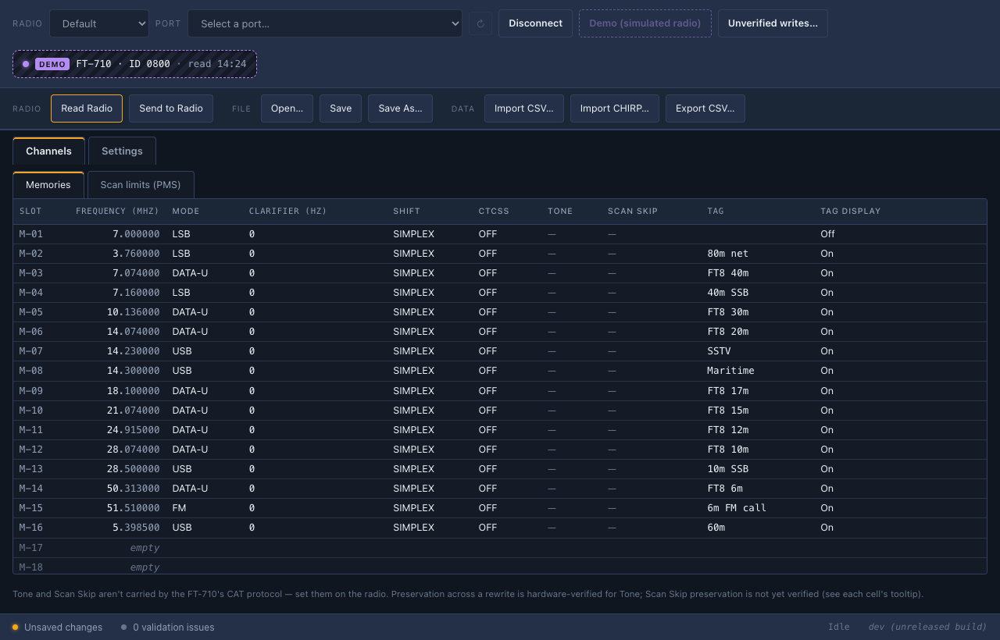

# Open Rig Programmer

A free memory-channel programmer for Yaesu and Icom radios. Read the
radio's memories into a file, edit them in a grid or a spreadsheet,
and send them back over the radio's ordinary USB cable. A desktop app
and a command-line tool, `rigprog`, for macOS, Windows and Linux.



## What it does

- **Edits channels in a grid**: keyboard navigation, paste from a
  spreadsheet, drag to copy, swap or move, and a picker for every
  column the radio understands.
- **Reads and writes over the USB cable**, with the radio's menu
  settings shown alongside on the Yaesu models.
- **Imports and exports CSV**, including CHIRP's, and reports anything
  a file cannot carry.
- **Keeps your radio safe**: it reads before it writes, saves a
  snapshot, shows every change for approval, and reads each channel
  back after writing it. Nothing is deleted and no menu setting is
  changed, ever.
- **Costs nothing and hides nothing**: GPL, with every protocol fact
  cited to the maker's manual, so it can stand in for the paid
  vendor programmers.

## Which radios

| Radio | Read | Write |
| --- | --- | --- |
| **FT-710** | ✅ | ✅ verified on a real radio |
| **FTdx10**, **FTdx101D**, **FTdx101MP**, **FT-891** | ✅ | ⚠️ opt-in |
| **IC-7610**, **IC-7300**, **IC-7300MK2**, **IC-705**, **IC-9700**, **IC-905**, **IC-7851**, **IC-7850**, **IC-7760**, **IC-7100** | ✅ | ⚠️ opt-in |
| **IC-R8600** (a receiver) | ✅ | ⚠️ opt-in |

Only the FT-710 has ever been connected to this program. The others
were built from the makers' protocol manuals and tested against
simulators: reading them is safe, and writing stays switched off until
you switch it on for that radio. Per-radio detail, including where the
program is guessing, is in [docs/radio-notes.md](docs/radio-notes.md).
Kenwood radios are next.

## Install

Everything is on the [Releases page](../../releases), with a
`SHA256SUMS` file to check any download.

- **macOS**: unzip the app. It is not notarised, so the first time,
  right-click it and choose *Open*. The command-line tool is a
  separate tarball.
- **Windows**: run the installer for your machine (amd64 or ARM64; the
  amd64 one refuses to run on an ARM64 PC). SmartScreen will say
  *Windows protected your PC*: click *More info*, then *Run anyway*.
  The zip is the command-line tool alone.
  [docs/windows-setup.md](docs/windows-setup.md) covers the serial
  driver.
- **Linux**: on Debian, Ubuntu or Mint, `sudo apt install ./<file>.deb`
  installs the app, the command line, a menu entry and the serial-port
  rule. Elsewhere, the tarball is a single static binary.
  [docs/linux-setup.md](docs/linux-setup.md) covers the `dialout` group
  and ModemManager.

## First use

Choose the radio and the port, connect (or pick *Demo* to try it with a
simulated radio), read, edit in the grid, then *Send*. Before anything
is transmitted, the app shows every change it is about to make, and
anything it refuses to make, with the reason.

The radio's USB adapter appears as two serial ports and only one
answers; on macOS only the right one will open, on Windows probe each
COM port in turn. The FT-710 needs firmware V01-10 or later.

The command line does the same job for scripts and backups:

```sh
rigprog read  --port /dev/cu.SLAB_USBtoUART --out radio.json   # save the memories
rigprog write --port /dev/cu.SLAB_USBtoUART edited.json        # preview, then send
```

`rigprog help` lists the rest: `ports`, `probe`, `diff`, `export`,
`import`, `settings` and `version`. Add `--model IC-7300` for another
radio, or `--fake` for the simulator.

### Switching on writes for an unverified radio

Every write command for the opt-in radios comes from the maker's own
manual, but none has been proven on a real radio, so the program
refuses to send any of them until you say so:

```sh
rigprog settings unverified-writes IC-7610 on     # allow writes to the IC-7610
```

The app asks the same question the first time you connect to one of
these radios, and its *Unverified writes…* button opens the list at any
time. Both share one settings file. Permission changes what the program
may send, not how carefully it sends it: the preview, the snapshot and
the read-back still run.

## Limits

- Channels cannot be deleted, and menu settings are never written
  ([docs/menu-write-decision.md](docs/menu-write-decision.md)); Icom
  menus are not read.
- On the FT-710, tone, scan-skip and clarifier cannot be set over CAT,
  so edits to them are refused rather than dropped.
- Everything per radio, from speed guesses to channels that are not
  read, is in [docs/radio-notes.md](docs/radio-notes.md).

## Help wanted

A report from a real radio is the most useful thing anyone can send:
any radio in the opt-in rows, an FT-710 on Linux, or an FT-710 on an
amd64 Windows PC. [Open an issue](../../issues/new/choose) with the
output of `rigprog version` and `rigprog probe`; one channel's line
from a read is plenty, since a whole memory file carries your callsign.

## For developers

[docs/developing.md](docs/developing.md) covers building from source,
the repository layout, the evidence records and releasing;
[CHANGELOG.md](CHANGELOG.md) lists what changed in each release.

## Licence

GPL-3.0-or-later; see [LICENSE](LICENSE). This program comes
**without any warranty**. If you connect it to your transceiver, you
do so entirely at your own risk; the authors accept no liability for
damage to your radio, its firmware or its memory contents.
